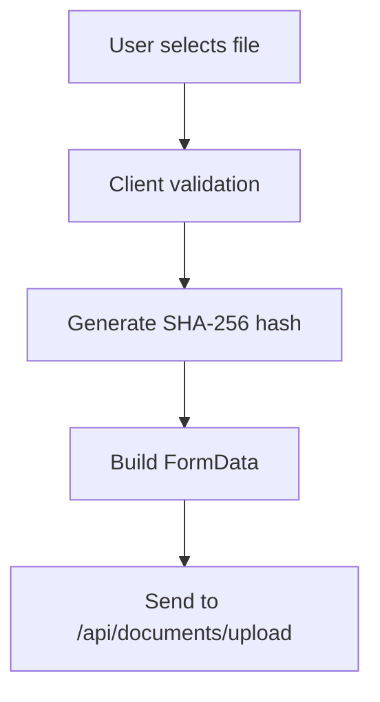
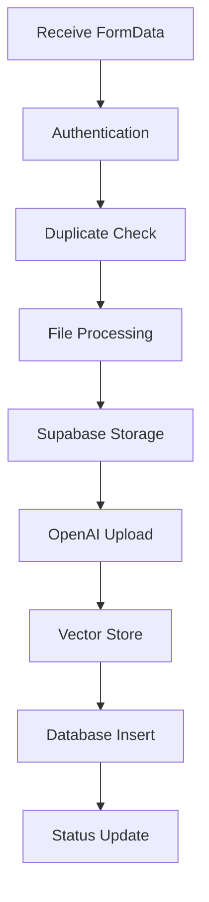
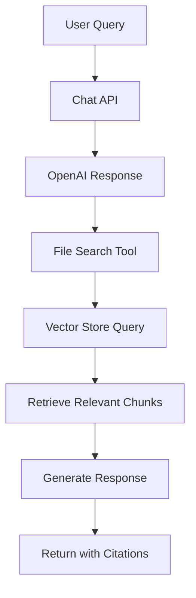

# SanadGPT - نظام إدارة وثائق التدقيق الذكي

**SanadGPT** is an intelligent audit document management system that leverages AI to provide accurate, citation-backed answers from uploaded documents. Built with modern web technologies and powered by OpenAI's advanced language models and vector databases.

## 🎯 Purpose & Vision

SanadGPT is designed to revolutionize how audit professionals and organizations manage, search, and extract insights from their document repositories. The system provides:

- **Intelligent Document Processing**: Automatic text extraction and indexing from various document formats
- **AI-Powered Q&A**: Natural language queries with accurate, citation-backed responses
- **Bilingual Support**: Full Arabic and English language support with RTL/LTR layouts
- **Secure Document Management**: Role-based access control and secure file storage
- **Real-time Collaboration**: Multi-user document sharing and management

## 🏗️ Architecture Overview

```
┌─────────────────┐    ┌─────────────────┐    ┌─────────────────┐
│   Frontend      │    │   Backend       │    │   External      │
│   (Next.js)     │◄──►│   (API Routes)  │◄──►│   Services      │
│                 │    │                 │    │                 │
│ • React 19      │    │ • Node.js       │    │ • OpenAI        │
│ • TypeScript    │    │ • TypeScript    │    │   Responses API │
│ • Tailwind CSS  │    │ • Supabase      │    │ • Vector Store  │
│ • RTL Support   │    │ • File Storage  │    │ • GPT-4o        │
└─────────────────┘    └─────────────────┘    └─────────────────┘
```

## 🛠️ Tech Stack

### Frontend

- **Next.js 15.5.4** - React framework with App Router
- **React 19.1.0** - Latest React with concurrent features
- **TypeScript 5** - Type-safe development
- **Tailwind CSS 4** - Utility-first CSS framework
- **Geist & Tajawal Fonts** - Modern typography with Arabic support

### Backend & APIs

- **Next.js API Routes** - Serverless API endpoints
- **Node.js Runtime** - Server-side execution
- **OpenAI SDK 6.2.0** - AI model integration with Responses API
- **Supabase 2.74.0** - Backend-as-a-Service

### Document Processing

- **OpenAI File Processing** - Automatic text extraction, chunking, and embedding generation
- **PDF-Parse 2.2.2** - Client-side preview generation only
- **Mammoth 1.11.0** - Client-side preview generation only
- **Canvas 3.2.0** - Image processing capabilities

### Development Tools

- **ESLint 9** - Code linting
- **Turbopack** - Fast bundler for development
- **ts-node 10.9.2** - TypeScript execution

## 🚀 Key Features

### 1. Document Management

- **Multi-format Support**: PDF, DOCX, TXT files
- **Drag & Drop Upload**: Intuitive file upload interface
- **Duplicate Detection**: SHA-256 hash-based duplicate prevention
- **File Organization**: Automatic categorization and metadata extraction
- **Storage Management**: Secure cloud storage with Supabase

### 2. AI-Powered Chat Interface

- **Natural Language Queries**: Ask questions in Arabic or English
- **Citation-Backed Answers**: Responses include source references
- **Conversation History**: Maintains context across chat sessions
- **Real-time Streaming**: Live response generation
- **Bilingual Support**: Seamless language switching

### 3. Vector Database & RAG Implementation

- **OpenAI Vector Store**: Automatic document processing, chunking, and embedding
- **Semantic Search**: Advanced similarity search capabilities
- **File Search Integration**: Direct integration with OpenAI's file search
- **Automatic Processing**: OpenAI handles all text extraction and vectorization automatically

### 4. User Management & Security

- **Role-Based Access Control**: Admin and user roles
- **Supabase Authentication**: Secure user authentication
- **Session Management**: Persistent login sessions
- **Data Isolation**: User-specific document access

### 5. Admin Dashboard

- **Analytics Overview**: Document and user statistics
- **User Management**: View and manage user accounts
- **Document Monitoring**: Track upload status and processing
- **System Settings**: Configure API keys and vector stores

## 📁 Project Structure

```
sanadgpt/
├── app/                          # Next.js App Router
│   ├── (auth)/                   # Authentication pages
│   │   ├── layout.tsx            # Auth layout
│   │   ├── login/page.tsx        # Login page
│   │   └── register/page.tsx     # Registration page
│   ├── api/                      # API routes
│   │   ├── admin/                # Admin endpoints
│   │   │   └── analytics/        # Analytics API
│   │   ├── chat/route.ts         # Chat API
│   │   └── documents/            # Document management APIs
│   │       ├── delete/route.ts   # Document deletion
│   │       ├── route.ts          # Document listing
│   │       ├── update-status/    # Status updates
│   │       └── upload/route.ts   # Document upload
│   ├── dashboard/                # Dashboard pages
│   │   ├── error.tsx             # Dashboard error page
│   │   ├── loading.tsx           # Dashboard loading page
│   │   └── page.tsx              # Main dashboard
│   ├── privacy-policy/page.tsx   # Privacy policy page
│   ├── terms-of-use/page.tsx     # Terms of use page
│   ├── error.tsx                 # Global error page
│   ├── favicon.ico               # Site favicon
│   ├── globals.css               # Global styles
│   ├── layout.tsx                # Root layout
│   ├── loading.tsx               # Global loading page
│   └── page.tsx                  # Homepage
├── components/                   # React components
│   ├── AdminDashboard.tsx        # Admin interface
│   ├── ChatInterface.tsx         # Chat component
│   ├── DocumentUpload.tsx        # File upload
│   ├── DocumentsList.tsx         # Document listing
│   ├── LanguageProvider.tsx      # i18n support
│   ├── LanguageShell.tsx         # Language wrapper component
│   └── LanguageToggle.tsx        # Language switcher
├── lib/                          # Utility libraries
│   ├── documentProcessor.ts      # Document processing
│   ├── openai.ts                 # OpenAI integration
│   ├── supabase.ts               # Supabase client
│   └── supabaseAdmin.ts          # Admin Supabase client
├── middleware.ts                 # Next.js middleware
├── eslint.config.mjs             # ESLint configuration
├── postcss.config.mjs           # PostCSS configuration
├── scripts/                      # Setup and utility scripts
│   ├── createVectorStore.js      # Vector store creation
│   ├── setupAdmin.js             # Admin user setup
│   ├── checkProcessingStatus.js  # Status monitoring
│   ├── checkUsers.js             # User verification
│   ├── createAdminUser.js        # Admin user creation
│   ├── fixProcessingDocuments.js # Fix document processing
│   ├── fixUserRolesPolicy.js    # Fix user roles policy
│   ├── fixUserRolesPolicy.sql   # SQL for user roles policy
│   ├── fixVectorStore.js        # Fix vector store issues
│   └── fixVectorStoreREST.js    # Fix vector store via REST
└── types/                        # TypeScript definitions
    └── index.ts                  # Type definitions
```

## 🔧 Environment Setup

### Prerequisites

- Node.js 18+
- npm or yarn
- Supabase account
- OpenAI API account

### Environment Variables

Create a `.env.local` file with the following variables:

```bash
# Supabase Configuration
NEXT_PUBLIC_SUPABASE_URL=your_supabase_project_url
NEXT_PUBLIC_SUPABASE_ANON_KEY=your_supabase_anon_key
SUPABASE_SERVICE_ROLE_KEY=your_supabase_service_role_key

# OpenAI Configuration
OPENAI_API_KEY=your_openai_api_key
OPENAI_VECTOR_STORE_ID=your_vector_store_id

# Application Configuration
NEXT_PUBLIC_SITE_URL=http://localhost:3000
```

### Installation Steps

1. **Clone the repository**

   ```bash
   git clone <repository-url>
   cd sanadgpt
   ```

2. **Install dependencies**

   ```bash
   npm install
   ```

3. **Set up Supabase**

   - Create a new Supabase project
   - Run the database migrations (see Database Setup section)
   - Configure storage bucket for documents

4. **Create OpenAI Vector Store**

   ```bash
   node scripts/createVectorStore.js
   ```

5. **Set up admin user**

   ```bash
   node scripts/setupAdmin.js admin@yourdomain.com
   ```

6. **Start development server**
   ```bash
   npm run dev
   ```

## 🗄️ Database Setup

### Supabase Tables

The application requires the following Supabase tables:

#### `documents` table

```sql
CREATE TABLE documents (
  id UUID DEFAULT gen_random_uuid() PRIMARY KEY,
  user_id UUID REFERENCES auth.users(id) ON DELETE CASCADE,
  title TEXT NOT NULL,
  file_path TEXT NOT NULL,
  file_hash TEXT NOT NULL,
  emirate_scope TEXT,
  authority_name TEXT,
  openai_file_id TEXT,
  openai_vector_store_id TEXT,
  uploaded_at TIMESTAMP WITH TIME ZONE DEFAULT NOW(),
  status TEXT DEFAULT 'processing',
  UNIQUE(user_id, file_hash)
);
```

#### `user_roles` table

```sql
CREATE TABLE user_roles (
  user_id UUID REFERENCES auth.users(id) ON DELETE CASCADE PRIMARY KEY,
  role TEXT NOT NULL CHECK (role IN ('admin', 'user')),
  created_at TIMESTAMP WITH TIME ZONE DEFAULT NOW()
);
```

#### Storage Bucket

Create a storage bucket named `documents` with the following policy:

```sql
-- Allow authenticated users to upload files
CREATE POLICY "Users can upload documents" ON storage.objects
FOR INSERT WITH CHECK (auth.role() = 'authenticated');

-- Allow users to view their own documents
CREATE POLICY "Users can view own documents" ON storage.objects
FOR SELECT USING (auth.uid()::text = (storage.foldername(name))[1]);

-- Allow users to delete their own documents
CREATE POLICY "Users can delete own documents" ON storage.objects
FOR DELETE USING (auth.uid()::text = (storage.foldername(name))[1]);
```

## 🔄 Technical Workflow

### Document Upload & Processing Pipeline

This section describes the exact technical workflow from document upload to query readiness:

#### **Phase 1: Client-Side Upload Preparation**



**Steps:**

1. **File Selection**: User selects PDF/DOCX/TXT file (max 50MB)
2. **Client Validation**:
   - File type validation (PDF, DOCX, TXT only)
   - File size validation (≤50MB)
   - User authentication check
3. **Hash Generation**: Browser generates SHA-256 hash for duplicate detection
4. **FormData Construction**:
   - `document`: File object
   - `title`: Document title
   - `emirate_scope`: Optional metadata
   - `authority_name`: Optional metadata

#### **Phase 2: Server-Side Upload Processing**



**Detailed Steps:**

1. **Authentication & Validation** (`/api/documents/upload`)

   - Extract user from Supabase session
   - Validate file presence and metadata
   - Generate SHA-256 hash from file buffer

2. **Duplicate Detection**

   ```sql
   SELECT id FROM documents
   WHERE file_hash = ? AND user_id = ?
   ```

   - If duplicate found: Return existing document ID
   - If not duplicate: Continue processing

3. **File Storage** (Supabase Storage)

   - Upload file to `documents` bucket
   - Path format: `{user_id}/{hash}.{extension}`
   - Content-Type: Original MIME type

4. **OpenAI File Upload**

   ```javascript
   const uploaded = await openai.files.create({
     file: await toFile(nodeBuffer, file.name),
     purpose: "assistants",
   });
   ```

   - Uploads raw file to OpenAI
   - Returns OpenAI file ID
   - **OpenAI automatically handles**: Text extraction, chunking, embedding generation

5. **Vector Store Integration**

   ```javascript
   await fetch(
     `https://api.openai.com/v1/vector_stores/${vectorStoreId}/files`,
     {
       method: "POST",
       body: JSON.stringify({ file_id: uploaded.id }),
     }
   );
   ```

   - Adds file to vector store for search
   - Enables semantic search capabilities

6. **Database Record Creation**

   ```sql
   INSERT INTO documents (
     user_id, title, file_path, file_hash,
     emirate_scope, authority_name,
     openai_file_id, openai_vector_store_id,
     status
   ) VALUES (?, ?, ?, ?, ?, ?, ?, ?, 'processing')
   ```

7. **Agent Builder Integration**
   - Files automatically processed by OpenAI Agent Builder
   - Status immediately set to "ready" for agent queries
   - No polling required - agent handles all processing

**Processing States:**

1. **`processing`** (Initial State)
   - File uploaded to OpenAI and vector store
   - Agent Builder begins processing automatically

2. **`ready`** (Final State)
   - Agent Builder has processed the file
   - Document is immediately available for agent queries
   - Users can ask questions and get accurate answers with citations

3. **`failed`** (Error State)
   - Upload or processing failed
   - Document not available for queries
   - Manual intervention may be required

**Agent Builder Processing**:

```javascript
// Agent Builder automatically handles file processing
const sanadgptAgent = new Agent({
  name: "SanadGPT Agent",
  instructions: "You are SanadGPT, a bilingual audit assistant...",
  model: "gpt-5",
  tools: [fileSearchTool(["vs_68eb60e012988191be5a60558a1f1de6"])],
  modelSettings: {
    reasoning: { effort: "low", summary: "auto" },
    store: true
  }
});

// Files are automatically processed and ready for queries
// No polling or status checking required
```

#### **Phase 4: Query Processing**



**Query Workflow** (`/api/chat`):

1. **Query Reception**

   - Receive user question and conversation history
   - Validate OpenAI API key and vector store ID

2. **OpenAI Response Generation** (Using Responses API)

   ```javascript
   const response = await openai.responses.create({
     model: "gpt-4o",
     tools: [
       {
         type: "file_search",
         vector_store_ids: [vectorStoreId],
       },
     ],
     input: [
       { role: "system", content: systemPrompt },
       ...conversationHistory,
       { role: "user", content: question },
     ],
   });
   
   // Extract content using output_text (Responses API specific)
   const content = response.output_text || "I couldn't process your request.";
   ```

3. **File Search Integration**

   - OpenAI automatically searches vector store
   - Retrieves relevant document chunks
   - Generates citations and page references

4. **Response Processing**
   - Extract content from OpenAI response
   - Include source citations
   - Return formatted response

### **Timing & Performance**

| Phase             | Duration        | Notes                                  |
| ----------------- | --------------- | -------------------------------------- |
| Client Upload     | 1-5 seconds     | Depends on file size                   |
| Server Processing | 2-10 seconds    | File upload + database operations      |
| Agent Builder Processing | Immediate | Agent Builder handles processing automatically |
| **Total Time**    | **3-15 seconds** | **Ready for queries**                  |

**Typical Processing Times:**
- **Small files (1-5MB)**: 3-8 seconds
- **Medium files (5-20MB)**: 5-12 seconds  
- **Large files (20-50MB)**: 8-15 seconds

**Key Improvement**: With Agent Builder, documents are **immediately ready** for queries after upload. No polling or status checking required!

### **Error Handling**

- **Upload Failures**: Return error with specific message
- **Duplicate Files**: Return existing document ID
- **OpenAI Errors**: Mark status as `failed`, log error details
- **Vector Store Errors**: Continue processing, log warnings
- **Status Check Failures**: Retry mechanism, manual status updates

## 🤖 OpenAI Integration

### API Architecture Choice

SanadGPT uses **OpenAI Agent Builder** with the **Agents SDK** for optimal performance and reliability:

- **Official Agent Builder**: Built using OpenAI's Agent Builder workflow system
- **Agents SDK Integration**: Uses `@openai/agents` package for seamless integration
- **Automatic File Processing**: Agent Builder handles file processing and vector store management
- **GPT-5 Model**: Leverages the latest GPT-5 model for superior performance
- **Built-in File Search**: Integrated file search tool with automatic citation handling

### Vector Store Setup

SanadGPT uses OpenAI's Vector Store for document indexing and retrieval:

1. **Automatic Processing**: Documents are automatically chunked and embedded
2. **File Search**: Integrated with OpenAI's file search capabilities via Responses API
3. **Semantic Search**: Advanced similarity search across document content
4. **Citation Support**: Automatic source attribution in responses

### API Usage

- **Model**: GPT-5 for superior performance and reasoning
- **API Type**: OpenAI Agent Builder with Agents SDK
- **File Search**: Built-in file search tool with automatic citation handling
- **Workflow ID**: `wf_68eb60b897a88190a7ea0f20a6eefa8f04fea11a9486fa43`
- **Vector Store**: `vs_68eb60e012988191be5a60558a1f1de6`
- **Bilingual**: Supports both Arabic and English queries with automatic language detection

## 🚀 Deployment

### Vercel Deployment

1. **Connect Repository**

   - Link your GitHub repository to Vercel
   - Configure build settings

2. **Environment Variables**

   - Add all environment variables in Vercel dashboard
   - Ensure `NEXT_PUBLIC_SITE_URL` points to your Vercel domain

3. **Build Configuration**

   ```json
   {
     "buildCommand": "npm run build",
     "outputDirectory": ".next",
     "installCommand": "npm install"
   }
   ```

4. **Deploy**
   - Vercel will automatically deploy on git push
   - Monitor deployment logs for any issues

### Production Considerations

- **Database**: Use Supabase production instance
- **Storage**: Configure proper CORS for file uploads
- **Security**: Enable RLS policies and secure API keys
- **Monitoring**: Set up error tracking and performance monitoring
- **Backup**: Regular database backups and file storage backups

## 🔒 Security Features

### Authentication & Authorization

- **Supabase Auth**: Secure user authentication
- **JWT Tokens**: Stateless session management
- **Role-Based Access**: Admin and user role separation
- **Row Level Security**: Database-level access control

### Data Protection

- **File Encryption**: Secure file storage
- **Hash Verification**: Duplicate detection and integrity
- **API Rate Limiting**: Prevent abuse
- **Input Validation**: Sanitize all user inputs

### Privacy

- **User Data Isolation**: Users can only access their own documents
- **Secure File Upload**: Validated file types and sizes
- **Session Management**: Secure session handling

## 🌐 Internationalization

### Language Support

- **Arabic (RTL)**: Primary language with right-to-left layout
- **English (LTR)**: Secondary language with left-to-right layout
- **Dynamic Switching**: Real-time language toggle
- **Font Optimization**: Geist (Latin) and Tajawal (Arabic) fonts

### Implementation

- **Context Provider**: Centralized language management
- **Local Storage**: Persistent language preferences
- **Component Integration**: All components support both languages
- **API Responses**: Bilingual AI responses

## 📊 Monitoring & Analytics

### Admin Dashboard Features

- **User Analytics**: Total users, active users, registration trends
- **Document Statistics**: Upload counts, processing status, file types
- **System Health**: API status, vector store status, error rates
- **Usage Metrics**: Chat interactions, document views, search queries

### Logging & Debugging

- **Console Logging**: Development and production logging
- **Error Tracking**: Comprehensive error handling
- **Performance Monitoring**: Response times and system metrics
- **User Activity**: Track user interactions and system usage

## 🧪 Testing & Quality Assurance

### Code Quality

- **TypeScript**: Full type safety
- **ESLint**: Code linting and style enforcement
- **Prettier**: Code formatting (if configured)
- **Git Hooks**: Pre-commit validation

### Testing Strategy

- **Unit Tests**: Component and utility testing
- **Integration Tests**: API endpoint testing
- **E2E Tests**: Full user flow testing
- **Performance Tests**: Load and stress testing

## 🔄 Development Workflow

### Local Development

```bash
# Start development server
npm run dev

# Build for production
npm run build

# Start production server
npm start

# Run linting
npm run lint
```

### Git Workflow

1. **Feature Branches**: Create feature branches for new functionality
2. **Code Review**: All changes require review
3. **Testing**: Run tests before merging
4. **Deployment**: Automatic deployment on main branch

## 📚 API Documentation

### Chat API (`/api/chat`)

```typescript
POST /api/chat
Content-Type: application/json

{
  "question": "What are the audit requirements?",
  "conversationHistory": [
    { "role": "user", "content": "Previous question" },
    { "role": "assistant", "content": "Previous answer" }
  ]
}

Response:
{
  "content": "Based on the uploaded documents..."
}
```

### Document Upload API (`/api/documents/upload`)

```typescript
POST /api/documents/upload
Content-Type: multipart/form-data

FormData:
- document: File
- title: string
- emirate_scope?: string
- authority_name?: string

Response:
{
  "id": "document-id",
  "title": "Document Title"
}
```

### Documents List API (`/api/documents`)

```typescript
GET /api/documents

Response:
{
  "documents": [
    {
      "id": "doc-id",
      "title": "Document Title",
      "file_path": "path/to/file",
      "openai_file_id": "file-abc123",
      "uploaded_at": "2024-01-01T00:00:00Z"
    }
  ]
}
```

## 🛠️ Troubleshooting

### Common Issues

#### Vector Store Not Found

```bash
# Recreate vector store
node scripts/createVectorStore.js
# Update OPENAI_VECTOR_STORE_ID in environment
```

#### Authentication Errors

```bash
# Check Supabase configuration
# Verify environment variables
# Check RLS policies
```

#### File Upload Failures

```bash
# Check file size limits (50MB max)
# Verify file type support
# Check Supabase storage configuration
```

#### Chat API Errors

```bash
# Verify OpenAI API key
# Check vector store ID
# Monitor API rate limits
```

### Debug Commands

```bash
# Check processing status
node scripts/checkProcessingStatus.js

# Verify users
node scripts/checkUsers.js

# Fix processing documents
node scripts/fixProcessingDocuments.js
```

## 🤝 Contributing

### Development Setup

1. Fork the repository
2. Create a feature branch
3. Make your changes
4. Add tests if applicable
5. Submit a pull request

### Code Standards

- **TypeScript**: Use strict typing
- **ESLint**: Follow linting rules
- **Components**: Use functional components with hooks
- **Styling**: Use Tailwind CSS classes
- **Documentation**: Comment complex logic

## 📄 License

This project is licensed under the MIT License - see the LICENSE file for details.

## 🙏 Acknowledgments

- **OpenAI** - For providing the AI models and vector store technology
- **Supabase** - For the backend infrastructure and authentication
- **Vercel** - For the deployment platform
- **Next.js Team** - For the excellent React framework
- **Tailwind CSS** - For the utility-first CSS framework

## 📞 Support

For support and questions:

- **Issues**: Create an issue in the GitHub repository
- **Documentation**: Check this README and inline code comments
- **Community**: Join our community discussions

---

**SanadGPT** - Empowering audit professionals with intelligent document management and AI-powered insights.
